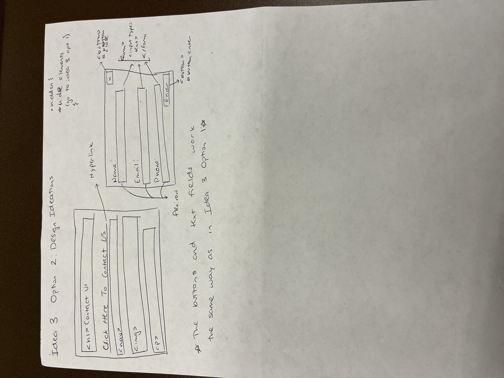
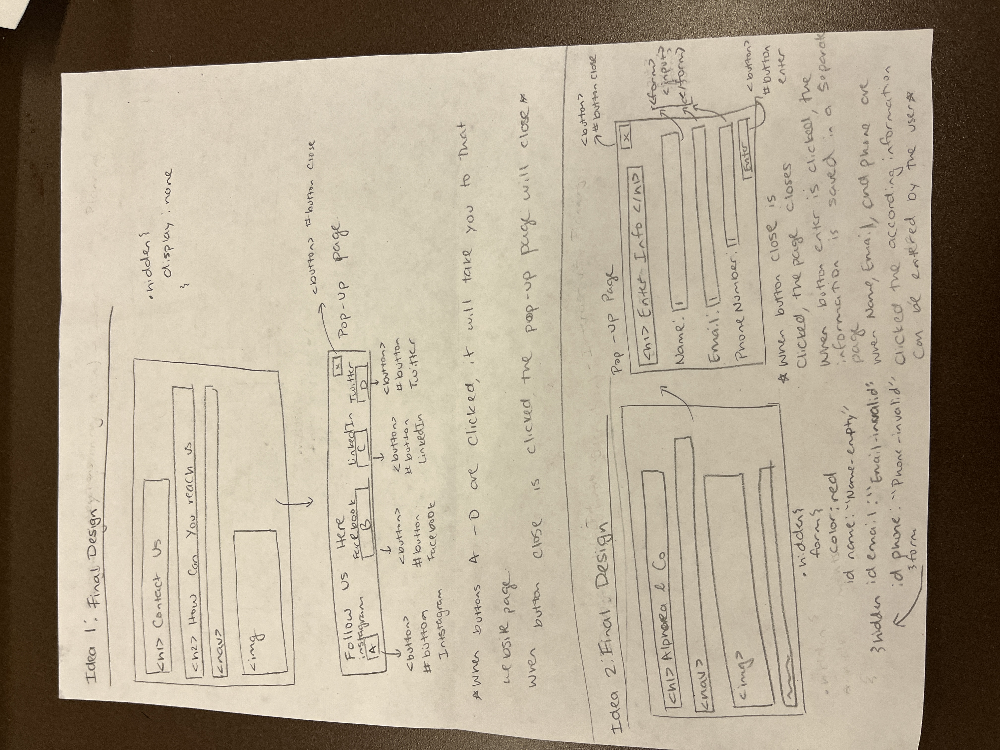
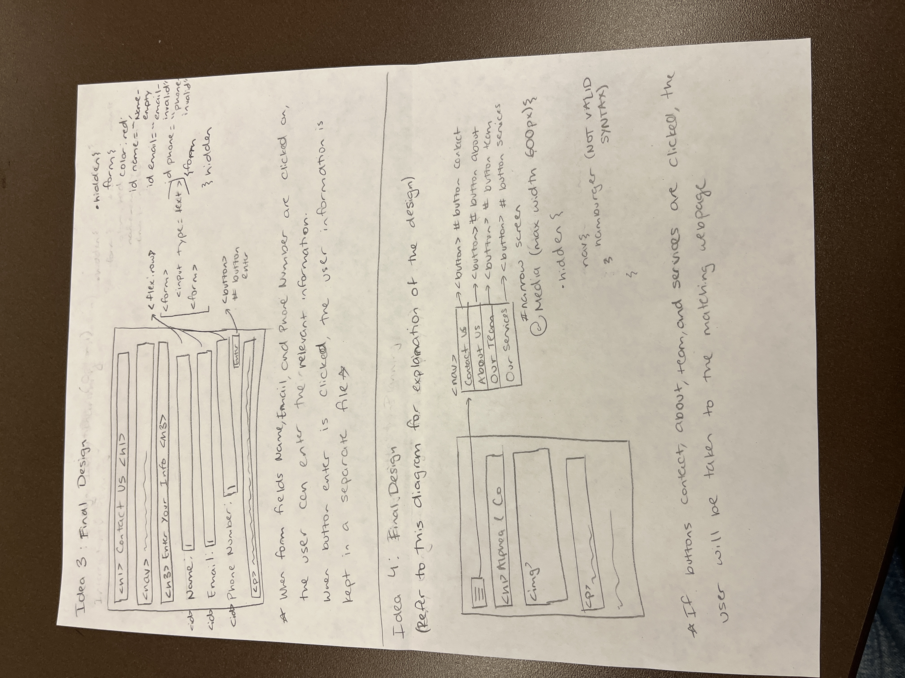
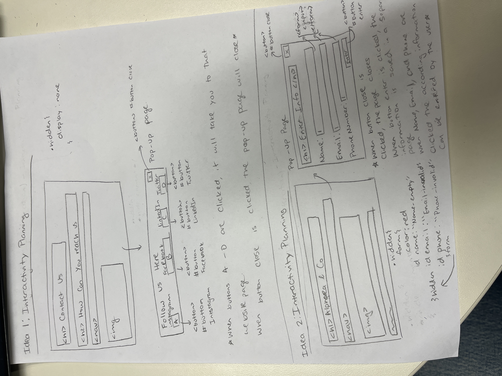
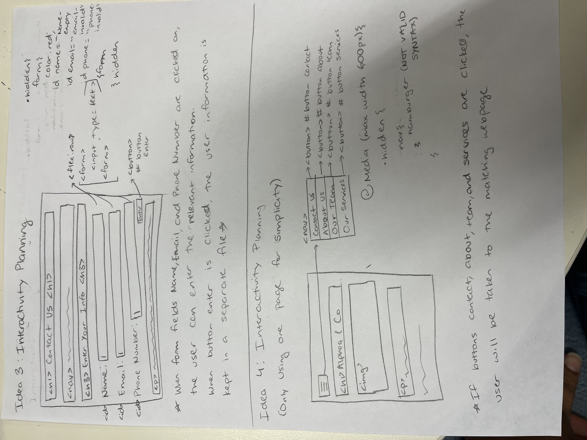

# Project 3: Design Journey

**For each milestone, complete only the sections that are labeled with that milestone.** Refine all sections before the final submission.

You are graded on your design process. If you later need to update your plan, **please do not delete the original plan, leave it in place and append your new plan _below_ the original.** Then explain why you are changing your plan. Any time you update your plan, you're documenting your design process!

**Replace ALL _TODOs_ with your work.** (There should be no TODOs in the final submission.)

Be clear and concise in your writing. Bullets points are encouraged.

**Everything, including images, must be visible in _Markdown: Open Preview_.** If it's not visible in the Markdown preview, then we can't grade it. We also can't give you partial credit either. **Please make sure your design journey should is easy to read for the grader;** in Markdown preview the question _and_ answer should have a blank line between them.

## Existing Project (Milestone 1)

**Tell us about the project you'll be using for Project 3.**

### Project (Milestone 1)
> Which project will you add interactivity to enhance the site's functionality?

Project 1

### Audience (Milestone 1)
> Briefly explain your site's audience.
> Be specific and justify why this audience is a **cohesive** group.

The audience would be people interested in partnering with Alphaea&Co as a corporation and/or learning about sustainable and accessible menstrual products -- Project 1 Audience

Updated Audience for Project 3: Specifically people who menstruate in the age range of 18-30 (Gen-z and millenials)

### Audience's Goals (Milestone 1)
> List the audience's goals that you identified in Project 1 or 2.
> Simply list each goal. No need to include the "Design Ideas and Choices", etc.
> You may adjust the goals if necessary.

1. Finding and learning about the services we provide

2. Learning about how Alphaea&Co developed and what bridge it hopes to gap

3.  How to get in contact with us as a corporation as well as links to our other social media platforms

4. An introduction to our teams and the roles we have

## Interactivity Design (Milestone 1)

### Interactivity Brainstorm (Milestone 1)
> Using the audience goals you identified, brainstorm possible options for interactivity to enhance the functionality of the site while also assisting the audience with their goals.
> Briefly explain each idea and provide a brief rationale for how the interactivity enhances the site's functionality for the audience.
> Note: You may find it easier to sketch for brainstorming. That's fine too. Do whatever you need to do to explore your ideas.

- Idea 1: A tab pops up with links to other social media platforms on the Contact Us page. When the button is clicked, the tab goes away (hidden class)
- Idea 2: A place to enter contact information on the Contact Us page. If a wrong format is entered, like using characters other than numbers for phone number or not using an @ in the email, an error message pops up.
- Idea 3: A tab pops up to put in contact information when you first come to the site, on the Home page. Similar to Idea 2, if the wrong format is entered, an error message from a hidden class pops up.
- Idea 4: Make the navigation bar a hamburger on narrow screen

Update: Ignore ideas 2 and 3, forms are not permitted.

### Interactivity Design Ideation (Milestone 1)
> Explore the possible design solutions for the interactivity.
> Sketch several iterations of your interactivity.
> Annotate each sketch explaining what happens when a user takes an action. (e.g. When user clicks this, something else appears.)

Update: Ignore designs for ideas 2 and 3, forms are not permitted.
**Valid email includes @ symbol and phone number entry only contains numbers**

### Final Interactivity Design (Milestone 1)
> Create _polished_ sketch(es) (it's still a sketch, but with a little more care taken to communicate ideas clearly to the graders) to plan your interactivity.
> **Sketch out the entire page where your interactivity will go.**
> Include your interactivity to the sketch(es).
> Add annotations to explain what happens when the user takes an action.
> Include as many sketches as necessary to communicate your design (ask yourself, could another 1300 take these sketches an implement my design?)

Update: Ignore designs for ideas 2 and 3, forms are not permitted.

**Valid email includes @ symbol and phone number entry only contains numbers**

### Interactivity Rationale (Milestone 1)
> Describe the purpose of your proposed interactivity.
> Provide a brief rationale explaining how your proposed interactivity addresses the goals of your site's audience.
> This should be about a paragraph. (3-5 sentences)

As discussed in my Project 1 milestone, the design goals combine current design trends and aesthetics of millenials and Gen-z. To cater to the millenials, the base of the design is very clean and minimalistic. This was achieved with straight lines, distinct edges, a mainly neutral color palette, and a significant amount of empty space around the content. Alternatively, the current trends for Gen-z are more bright and fun. In order to incorporate this in a cohesive theme, bright colors that are still completary to neutrals were used, such as a muted red and bright green through images of greenery. The greenery also serves as a visual cue of the sustainable aspect of the company. Additionally, the 'fun' or playful aspect of Gen-z aesthetic was also added through the fonts used as they have some curvature. This design will be further worked on in order to make the site cleaner and more in line with the design rationale.

## Interactivity Implementation Plan (Milestone 1)

### Interactivity Planning Sketches (Milestone 1)
> Produce planning sketches that include all the details another 1300 student would need to implement your interactivity design.

Update: Ignore designs for ideas 2 and 3, forms are not permitted.

**Valid email includes @ symbol and phone number entry only contains numbers**

### Interactivity Pseudocode Plan (Milestone 1)
> Write your interactivity pseudocode plan here.
> Pseudocode is not JavaScript. Please do not put JavaScript code here.

Idea 1:
If clicked on contact.html, remove div.hidden from div (event)

  add .hidden to #socials_banner

Idea 2:
If clicked on index.html, remove div.hidden from div

If empty input in Name, remove.hidden from id Name.
Show hidden error message: "Name-Empty"

If invalid input or empty input in Email, remove.hidden from id Email.
Show hidden error message: "Email-Invalid"

If invalid input or empty input in Phone Number, remove.hidden from id phoneNumber.
Show hidden error message: "Phone Number-Invalid"

Update: Ignore idea 2, forms are not permitted.

Idea 3:
If clicked on Click Here to Contact Us, remove div.hidden from div

If empty input in Name, remove.hidden from id Name.
Show hidden error message: "Name-Empty"

If invalid input or empty input in Email, remove.hidden from id Email.
Show hidden error message: "Email-Invalid"

If invalid input or empty input in Phone Number, remove.hidden from id phoneNumber.
Show hidden error message: "Phone Number-Invalid"

Update: Ignore idea 3, forms are not permitted.

(Idea 2 and 3 are very similar in execution, however they are different in regards to purpose and location)

Idea 4:
If width>(less than) 600 px. remove div.hidden from div
    add .hidden to #nav_bar

    .hidden{
        display: none;
        nav: hamburger (exact code is not written, but I am aware that this is not valid syntax and it is much more complex to add a hamburger bar)
    }

### "Ambitious" Interactivity Explanation (Milestone 1)
> In your own words, concisely explain why you believe your interactivity meets the "ambitious" requirement.
> This should be a few sentences. (1-3 sentences)

While the events planned in regards to interactivity are quite standard and have been covered in class, the page popping up as soon as you go to another page is something I've never done and we haven't been taught yet. I'm excited to further my learning on an individual basis and improve upon my website. Additionally, I feel that adding a hamburger bar is an important skill as many websites utilize this tool, especially in narrow screens so it is a useful aspect to know how to code.

## Grading (Final Submission)

### Interactivity Usability Justification (Final Submission)
> Explain how your design effectively uses affordances, visibility, feedback, and familiarity.
> Write a large paragraph (4-6 sentences)

This design effectively uses affordances as there is a clearly labeled hamburger icon at the top of the page. This additionally plays into the visibility of the design as it is at the top of the page. The hamburger icon is a well-known symbol for a website so it uses familiarity and it uses feeback by responding to the button click. There is no incorrect way to access the menu so there is no error message.

### Tell Us What to Grade (Final Submission)
> We aren't re-grading your Project 1 or 2.
> We are only grading the interactivity you added.
> Tell us where (what pages) we can find your interactivity and how to use it.
> **We will only grade what you list here;** if it's not listed, we won't grade it.

The hamburger icon that is menu

### Collaborators (Final Submission)
> List any persons you collaborated with on this project.

No collaborators

### Reference Resources (Final Submission)
> Please cite any external resources you referenced in the creation of your project.
> (i.e. W3Schools, StackOverflow, Mozilla, etc.)

Java-script snippets from class

### Self-Reflection (Final Submission)
> This was the first project in this class where you coded some JavaScript. What did you learn from this experience?

This was a very difficult experience as this was my first time using Javascript and I had to simplify the project significantly from what I expected. I learnt how implementing Javascript is really a holistic experience of all three languages

> Take some time here to reflect on how much you've learned since you started this class. It's often easy to ignore our own progress. Take a moment and think about your accomplishments in this class. Hopefully you'll recognize that you've accomplished a lot and that you should be very proud of those accomplishments!

I am proud of what I made but I'm upset it wasn't as good as it could've been even though I worked with TAs.
